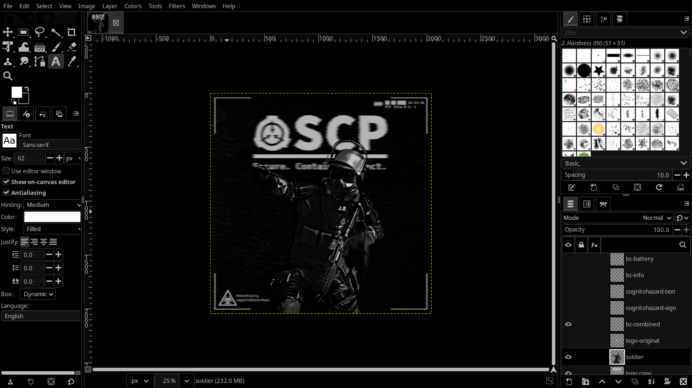

<div align="center">

# Amoled for GIMP



</div>

# Installation

### Windows
Copy the CSS under `3.0` to `C:\Users\your_user\AppData\Local\Programs\GIMP 3\share\gimp\3.0\themes\Default`

### Linux

#### Standard GIMP
```
cp 3.0/common-dark.css 3.0/gimp-dark.css /usr/share/gimp/3.0/themes/Default/
```

#### GIMP flatpak
```
cp 3.0/common-dark.css 3.0/gimp-dark.css /var/lib/flatpak/app/org.gimp.GIMP/x86_64/stable/active/files/share/gimp/3.0/themes/Default/
```

# Credit
Huge thanks to [NickIsOnYT](https://github.com/NickIsOnYT/gimp-amoled) for creating the base of this theme.
